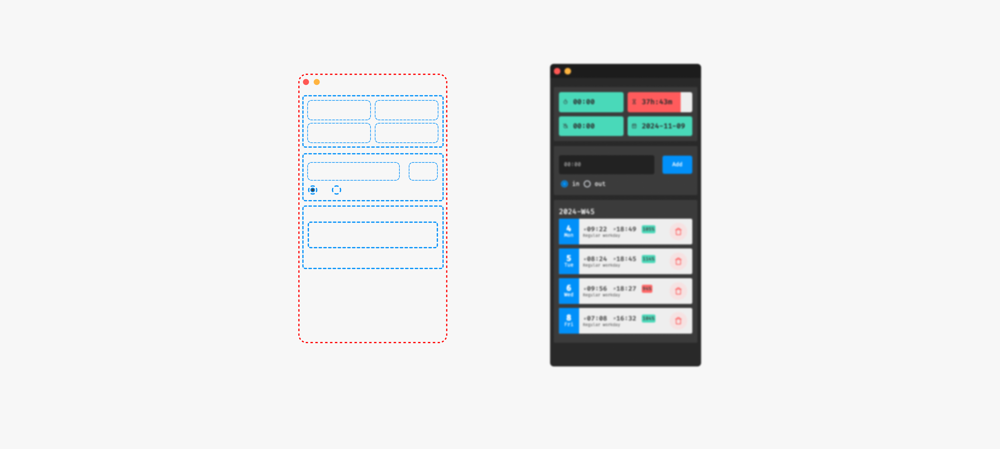

## Time Manager App


##### This is a cross-platform Time Manager App developed using the Tauri framework, which enables lightweight, high-performance applications for macOS, Windows, Linux, iOS, and Android. The primary focus of this app is on macOS, though Tauri’s flexibility ensures compatibility across multiple systems.

## Why Tauri?
##### Tauri is a great alternative to Electron, designed with a more secure foundation, faster performance (written in Rust), and smaller build sizes by leveraging the native WebView of the system. The main benefits of Tauri include:

- Secure: Built with a secure foundation to minimize security risks.
- Efficient: Uses the system’s native WebView, leading to a smaller bundle size and faster performance.
- Flexible: Allows developers to use any frontend (e.g., React, Vue) and provides bindings for multiple languages.
Prerequisites
#### To set up this app, make sure you have the following installed:

1. Node.js (v14 or higher recommended)
2. Yarn: You can install it globally with:
3. Rust: Tauri relies on Rust, so you’ll need to configure it using [`rustup`](https://www.rust-lang.org/tools/install).

#### Setup
To set up and run the Time Manager App, follow these steps:

1. Install Rust and Set Up Rustup
Install Rust by running the following command. This command will download and install Rust along with the rustup tool.

```bash
curl --proto '=https' --tlsv1.2 -sSf https://sh.rustup.rs | sh
```
After installation, follow any further instructions in the terminal to ensure `rustup` is correctly configured in your environment.

2. Create a New Tauri Project
Navigate to your preferred project directory and use Yarn to create a new Tauri project.

```bash
yarn create tauri-app
```
Follow the on-screen prompts to set up your project. You may need to select specific options, such as the frontend framework (e.g., React, Vue, Svelte), depending on your preferences for this Time Manager App.

3. Clean the Cache (macOS Specific)
After creating the project, you may need to clean the cache to avoid issues related to WebKit. On macOS, run the following command:

```bash
rm -rf ~/Library/WebKit/time-manager/
```

4. Run the App
Now you’re ready to start the app in development mode. This will compile the app and open it in a new window.

- On macOS or Windows, use:
```bash
yarn tauri dev
```
- For production builds, you can use:
```bash
yarn tauri build
```
This command generates a release-ready version of your app in the src-tauri/target/release directory.

### Development Details
#### Project Structure
- src: Contains the frontend files for the Time Manager App (HTML, CSS, JavaScript).
- src-tauri: Contains Tauri-specific files and Rust source code for backend functionality.

### Key Tauri Commands
- `yarn tauri dev`: Starts the app in development mode.
- `yarn tauri build`: Builds the app for production.
- `yarn tauri icon`: Allows customization of app icons.
- `yarn tauri info`: Displays information about the app’s configuration.

### Additional Configuration
You can adjust configurations within src-tauri/tauri.conf.json to fine-tune permissions, settings, and other options relevant to your specific environment (such as customizing the app’s title, identifiers, and specific WebView configurations).

### Key Dependencies
- Tauri: Core framework for managing application logic and rendering.
- Frontend Framework (optional): Choose from React, Vue, Svelte, etc., based on preference.
- Rust: Backend logic and system integration. The primary language used in Tauri.

### Troubleshooting
- Cache Issues: If you encounter cache issues, particularly on macOS, remember to clear the cache with 
```bash
rm -rf ~/Library/WebKit/time-manager/
```
- Permissions: Ensure that you have granted necessary permissions to the app on macOS by going to System Preferences > Security & Privacy.
Resources
